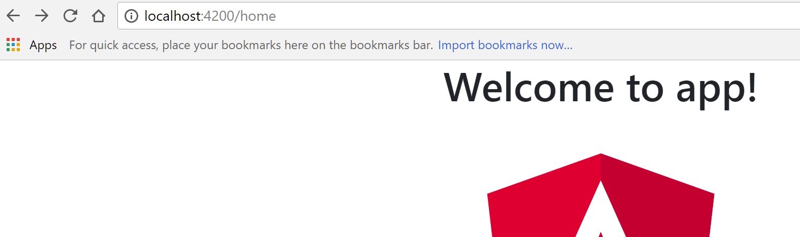
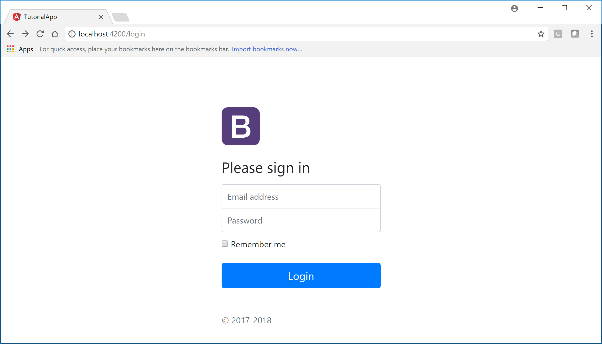

# Angular 5 & Bootstrap 4 Templates

This is a step by step instruction on how to integrate Bootstrap 4 with your Angular 5 cli applicaiton. 

## Generate Angular 5 CLI application

1. First of, let's install Angular CLI if you have't done it already

```
npm install -g @angular/cli@latest
```

2. Generate a new Angular 5 appplication using the Latest Angular CLI.

```
ng new ng5-bs4-template
```

3. Run the application to make sure, the generated app is working as expected without any issues before we add further dependencies.

```
ng serve
```

Navigate to http://localhost4200 and make sure the app is running.



## Add Bootstrap 4  & ng-bootstrap as dependencies

1. Install Bootstra 4 as a depedency

```
npm install --save bootstrap
```
Let's also install [ng-bootstrap](https://ng-bootstrap.github.io/#/home). This will be needed for the Regular Bootstrap components to continue working under Angular environment.

```
npm install --save @ng-bootstrap/ng-bootstrap
```

2. Open **styles.css** file generated by Angular CLI and add following line.

```
@import "~bootstrap/dist/css/bootstrap.css";

body {
    padding-top: 80px; 
 }
 .starter-template {
     padding: 3rem 1.5rem;
     text-align: center;
 }

```

And at this point the Basic Bootstrap 4 integration is completed. Next, let's create [Starter Examples](https://getbootstrap.com/docs/4.0/examples/) from Bootstrap 4 Website into our Angular 5 applicaiton. 

## Create Layout pages for your Secure and Public pages

If you are building an application that has some secure pages, you will want to have few pages (Login/Register/ForgetPassword) pages that look different than your secure pages. And the Layout of these public pages are typically differnt form your secure pages. So in thiss step we will create these so called Layout pages for our Secure and Public pages. 

1. Generate Public and Secure Layout components

```
ng g component layout/public

ng g component layout/secure
```

Update the content of following two files.

- public.component.html
- secure.component.html
- app.component.html

```
<router-outlet></router-outlet>
```

2. Generate Home & Login Components

```
ng g component public/login

ng g component secure/home
```

Update contents of the **home.component.html** to the following html, which I copied from [Bootstrap 4's Starter template](https://getbootstrap.com/docs/4.0/examples/starter-template/).

```
    <nav class="navbar navbar-expand-md navbar-dark bg-dark fixed-top">
    <a class="navbar-brand" href="#">Navbar</a>

    <button class="navbar-toggler" type="button" 
    (click)="isNavbarCollapsed = !isNavbarCollapsed"
    data-toggle="collapse"
    data-target="#navbarsExampleDefault" 
    aria-controls="navbarsExampleDefault" 
    aria-expanded="false" aria-label="Toggle navigation">
        <span class="navbar-toggler-icon"></span>
    </button>

    <div [ngbCollapse]="isNavbarCollapsed" class="collapse navbar-collapse" id="navbarsExampleDefault">
        <ul class="navbar-nav mr-auto">
        <li class="nav-item active">
            <a class="nav-link" href="#">Home <span class="sr-only">(current)</span></a>
        </li>
        <li class="nav-item">
            <!-- <a class="nav-link" href="#">Link</a> -->
            <a class="nav-link" routerLink="/login">Login</a>
        </li>
        <li class="nav-item">
            <a class="nav-link disabled" href="#">Disabled</a>
        </li>
        

        <li class="nav-item dropdown" ngbDropdown>
    <a class="nav-link dropdown-toggle" id="dropdown01" ngbDropdownToggle>Category</a>
    <div class="dropdown-menu" aria-labelledby="dropdown01" ngbDropdownMenu>
        <a class="dropdown-item" href="#">Action</a>
        <a class="dropdown-item" href="#">Another Action</a>
    </div>
    </li>
        </ul>
        <form class="form-inline my-2 my-lg-0">
        <input class="form-control mr-sm-2" type="text" placeholder="Search" aria-label="Search">
        <button class="btn btn-outline-success my-2 my-sm-0" type="submit">Search</button>
        </form>
    </div>
    </nav>

    <main role="main" class="container">

      <div class="starter-template">
        <h1>Bootstrap starter template</h1>
        <p class="lead">Use this document as a way to quickly start any new project.<br> All you get is this text and a mostly barebones HTML document.</p>
      </div>

    </main>
```

Update the contents of the **login.component.html** to following. Again copied from the [Login Bootstrap 4](https://getbootstrap.com/docs/4.0/examples/sign-in/) Sample.

```
<form class="form-signin">
  
  <h1 class="h3 mb-3 font-weight-normal">Please sign in</h1>
  <label for="inputEmail" class="sr-only">Email address</label>
  <input type="email" id="inputEmail" class="form-control" placeholder="Email address" required autofocus>
  <label for="inputPassword" class="sr-only">Password</label>
  <input type="password" id="inputPassword" class="form-control" placeholder="Password" required>
  <div class="checkbox mb-3">
    <label>
      <input type="checkbox" value="remember-me"> Remember me
    </label>
  </div>
  <!-- <button class="btn btn-lg btn-primary btn-block" type="submit">Sign in</button> -->
  <a class="btn btn-lg btn-primary btn-block" routerLink="/home">Login</a>
  <p class="mt-5 mb-3 text-muted">&copy; 2017-2018</p>
</form>
```

3. Generate routes for our Public and Secure pages by generating following two files

- layout/secure/**secure.routes.ts**
- layout/public/**public.routes.ts**

**public.routes.ts**
```
import { LoginComponent } from '../../public/login/login.component'
import { Routes, RouterModule } from '@angular/router';


export const PUBLIC_ROUTES: Routes = [
    { path: '', redirectTo: 'login', pathMatch: 'full' },
    { path: 'login', component: LoginComponent }
];
```

**secure.routes.ts**
```
import { HomeComponent } from '../../secure/home/home.component'
import { Routes, RouterModule } from '@angular/router';


export const SECURE_ROUTES: Routes = [
    { path: 'home', component: HomeComponent },
];
```
4. Export the Layout components as Module to make import easier 

Generate index.ts files under **layout/public**  and **layout/secure** folders

In **layout/public/index.ts** file
```
export * from './public.component';
export * from './public.routes';
```


In **layout/secure/index.ts** file
```
export * from './secure.component';
export * from './secure.routes';
```


5. Add the **app.routing.module.ts** under app folder and update contents as below.

```
import { NgModule } from '@angular/core';
import { Routes, RouterModule } from '@angular/router';
import { SecureComponent, SECURE_ROUTES } from './layout/secure';
import { PublicComponent, PUBLIC_ROUTES } from './layout/public';
/**
 * Route constant 
 */
const routes: Routes = [
    { path: '', redirectTo: 'login', pathMatch: 'full' },
    { path: '', component: PublicComponent, data: { title: 'Public Views' }, children: PUBLIC_ROUTES },
    { path: '', component: SecureComponent, data: { title: 'Secure Views' }, children: SECURE_ROUTES },
    { path: '**', redirectTo: 'login' }
];

/**
 * App routing module
 */
@NgModule({
    imports: [
        RouterModule.forRoot(routes)
    ],
    exports: [RouterModule]
})
export class AppRoutingModule { }
```

6. Import the AppRoutingModule in the All Module.

Import AppRoutingModule & NgBootstrap modules in the **app.module.ts** file. 
```
import { NgbModule } from '@ng-bootstrap/ng-bootstrap';
import { AppRoutingModule } from './app.routing.module'
```

Update Imports as below.

```
imports: [
    BrowserModule,
    NgbModule.forRoot(),
    AppRoutingModule
  ]
```

Go ahead and run the application.




## Extract Top Navigation as a new Component

Okey, so everything is working as expected except one thing. The TopNav's HTML mark up is part off Home component which is extendable at all. And what I mean by that is, when you add a new Secure page and needs to have a TopNav you will have to copy/paste same markup in that new component as well. 

Insstead let's extract out thie Top Navigation as an independent component. 

1. Generate a new app-header component.

```
ng g component components/app-header --module app
```

**Change the selector from app-app-header to just app-header in the app-header.component.ts file**

The --module app flag is needed since we also have AppRoutingModule along with AppModule and CLI can not make the decision for you as to where you want to import this new component. Hense the flag is needed.

Cut following markup from **home.component.ts** file to **app-header.component.html** file.

```
<nav class="navbar navbar-expand-md navbar-dark bg-dark fixed-top">
  <a class="navbar-brand" href="#">Navbar</a>

  <button class="navbar-toggler" type="button" (click)="isNavbarCollapsed = !isNavbarCollapsed" data-toggle="collapse" data-target="#navbarsExampleDefault"
    aria-controls="navbarsExampleDefault" aria-expanded="false" aria-label="Toggle navigation">
    <span class="navbar-toggler-icon"></span>
  </button>

  <div [ngbCollapse]="isNavbarCollapsed" class="collapse navbar-collapse" id="navbarsExampleDefault">
    <ul class="navbar-nav mr-auto">
      <li class="nav-item active">
        <a class="nav-link" href="#">Home
          <span class="sr-only">(current)</span>
        </a>
      </li>
      <li class="nav-item">
        <!-- <a class="nav-link" href="#">Link</a> -->
        <a class="nav-link" routerLink="/login">Login</a>
      </li>
      <li class="nav-item">
        <a class="nav-link disabled" href="#">Disabled</a>
      </li>


      <li class="nav-item dropdown" ngbDropdown>
        <a class="nav-link dropdown-toggle" id="dropdown01" ngbDropdownToggle>Category</a>
        <div class="dropdown-menu" aria-labelledby="dropdown01" ngbDropdownMenu>
          <a class="dropdown-item" href="#">Angular</a>
          <a class="dropdown-item" href="#">React</a>
          <a class="dropdown-item" href="#">Vue.js</a>
        </div>
      </li>
    </ul>
    <form class="form-inline my-2 my-lg-0">
      <input class="form-control mr-sm-2" type="text" placeholder="Search" aria-label="Search">
      <button class="btn btn-outline-success my-2 my-sm-0" type="submit">Search</button>
    </form>
  </div>
</nav>
```

Update the **layout/secure.component.html** as below.

```
<app-header></app-header>
<router-outlet></router-outlet>
```

Go ahead and run the application again, and everything should continue working as before. The only difference is that Top Navigation is now it's own component and automatically gets assigned to all of our Secure pages. 


